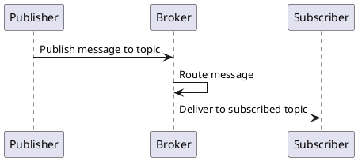
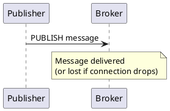
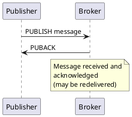
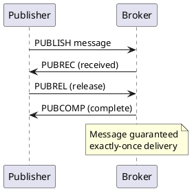

## Why use MQTT?

Http is one to one.
Http does not have offline handling
Only request response cycles..

The MQTT architecture uses a central Broker that handles all message routing between Publishers and Subscribers.

Payload(20B) in MQTT, which is signifantly lower as compared to HTTP.

## Quality of Service

Quality of Service (QoS) in MQTT defines the guarantee level for message delivery between clients and brokers.

### QoS 0 - At Most Once

The device publishes to the broker with no acknowledgment. If the connection is lost, the message may be lost. This is the fastest method but offers no delivery guarantee.

**Use case**: Non-critical sensor readings, real-time data where occasional loss is acceptable.

### QoS 1 - At Least Once

The broker sends a PUBACK acknowledgment to guarantee delivery. If the publisher doesn't receive the acknowledgment, it will retry sending the message. This ensures the message reaches the broker at least once, but duplicates are possible.

**Use case**: Home automation commands, notifications where you need confirmation but can tolerate duplicates.

### QoS 2 - Exactly Once

This is the most reliable but slowest method. The exchange involves a four-step handshake: PUBLISH → PUBREC → PUBREL → PUBCOMP. This guarantees exactly-once delivery with no duplicates.

**Use case**: Financial transactions, critical control commands where duplicates cannot be tolerated.

### Offline handling

If the subscriber is offline, the Broker will retain the message.
When the subscriber comes online again, it will pull the message for the topic.

## How connection happens

Publisher -> Broker CONNECT

data sent == {
topic
Payload
QoS
Retain
}

Client <- Broker CONN ACK

## Disconnect

Publisher send the disconnect tcp packet to Broker. Broker will then not publish to others.
