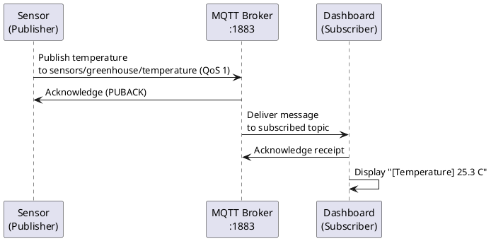

## Project Overview

GoMQTT is a demonstration project implementing MQTT (Message Queuing Telemetry Transport) publish-subscribe architecture using Go. It simulates a real-world IoT scenario where a greenhouse sensor continuously publishes temperature readings to an MQTT broker, and a dashboard application subscribes to receive and display these readings in real-time.

### Components

1. **Broker** (`broker/main.go`):

   - Central MQTT message broker running on port 1883
   - Handles all message routing between publishers and subscribers
   - Uses the Mochi MQTT library (`github.com/mochi-mqtt/server/v2`)
   - Requires no authentication (AllowHook enabled)

2. **Sensor/Client** (`sensor/main.go`):

   - Simulates a greenhouse temperature sensor
   - Publishes temperature readings to topic `sensors/greenhouse/temperature`
   - Publishes status updates to topic `sensors/greenhouse/status`
   - Generates random temperature values between 20-30°C every 2 seconds
   - Uses QoS level 1 (At Least Once delivery guarantee)

3. **Dashboard** (`dashboard/main.go`):
   - Subscriber application that monitors sensor data
   - Subscribes to `sensors/greenhouse/#` (wildcard to capture all greenhouse topics)
   - Displays temperature readings in real-time
   - Alerts when sensor goes offline
   - Uses QoS level 1 to ensure message delivery

## Prerequisites

- Go 1.24.0 or higher
- All dependencies are listed in `go.mod` and will be installed automatically

## Running the Project

The project requires three separate terminal windows. **Always start the broker first**, then start both the dashboard and sensor clients (order of dashboard/sensor doesn't matter).

### Terminal 1: Start the Broker First

```bash
cd broker
go run .
```

Expected output:

```
2026/03/28 16:06:00 Server started at port :1883
```

The broker is now listening on `localhost:1883` and ready to accept connections.

### Terminal 2: Start the Dashboard (Subscriber)

Open a **new terminal** and run:

```bash
cd dashboard
go run .
```

Expected output:

```
2026/03/28 16:06:03 Dashboard connected to broker
2026/03/28 16:06:03 Subscribed to sensors/greenhouse/#
```

The dashboard is now waiting to receive messages from the sensor.

### Terminal 3: Start the Sensor/Client (Publisher)

Open a **third terminal** and run:

```bash
cd sensor
go run .
```

Expected output:

```
2026/03/28 16:06:58 Sensor connected to broker
2026/03/28 16:06:58 Publish: 20.4 C
2026/03/28 16:07:00 Publish: 28.1 C
2026/03/28 16:07:02 Publish: 21.4 C
...
```

Once the sensor connects, you should see temperature readings appearing in the **dashboard terminal** in real-time:

```
[Temperature] 20.4 C
[Temperature] 28.1 C
[Temperature] 21.4 C
```

## Message Flow



## Project Structure

```
GoMQTT/
├── broker/         # MQTT Broker implementation
│   └── main.go     # Broker server code
├── dashboard/      # Subscriber/Dashboard application
│   └── main.go     # Dashboard UI (console-based)
├── sensor/         # Publisher/Sensor simulation
│   └── main.go     # Sensor data generator
├── go.mod          # Go module dependencies
├── go.sum          # Go module checksums
└── README.md       # This file
```

## Stopping the Project

To cleanly shut down the project:

1. Press `Ctrl+C` in the **sensor terminal** first
2. Press `Ctrl+C` in the **dashboard terminal**
3. Press `Ctrl+C` in the **broker terminal** last

Each component will log a shutdown message:

```
Sensor shutting down
Dashboard shutting down...
Shutting down broker....
```

## Key Concepts Demonstrated

- **MQTT Publish-Subscribe**: Decoupled communication pattern
- **QoS Level 1**: Guaranteed at-least-once message delivery
- **Topic Wildcards**: Using `#` to subscribe to multiple topics
- **Graceful Shutdown**: Proper cleanup with signal handlers
- **Message Retention**: Retained messages persist on the broker
